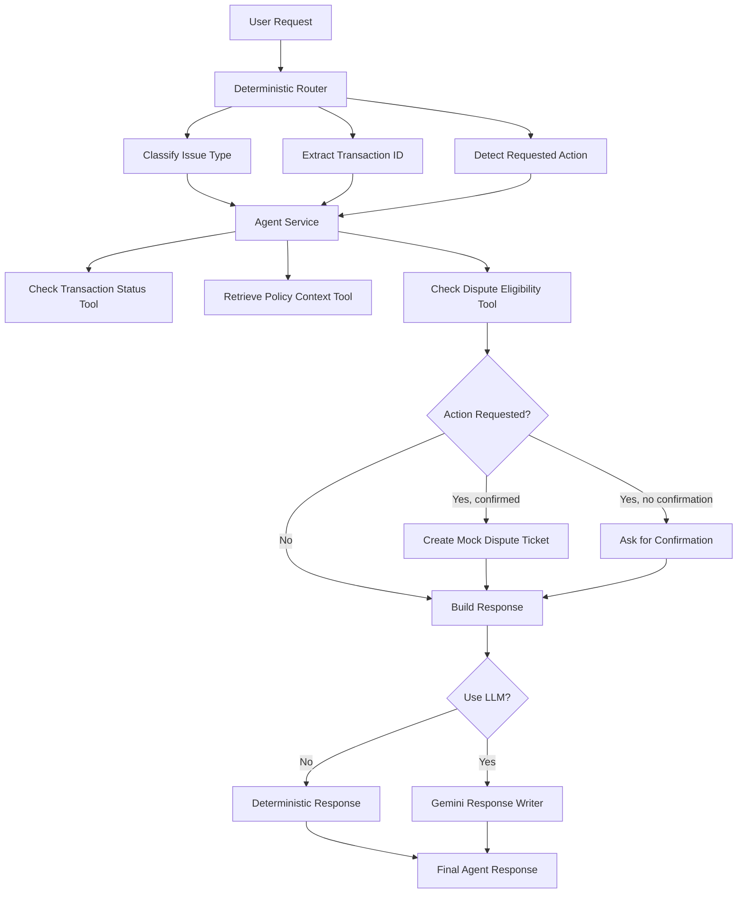

# Architecture

## Overview

The Banking Support Agent is a controlled tool-using agent for banking and fintech support scenarios.

The project demonstrates how an AI agent can use typed tools, deterministic routing, optional LLM-assisted response generation, and confirmation-gated action tools.

The core design principle is:

```text
Python controls the workflow.
Tools provide facts and actions.
The LLM only writes the final customer-facing response when enabled.
```

## High-Level Flow

```text
User Request
↓
FastAPI API or CLI Runner
↓
Deterministic Router
↓
Safe Tool Execution
↓
Optional Gemini Response Writer
↓
Final Agent Response
```

## Agent Flow



## Main Layers

### Core Layer

Location:

```text
src/banking_agent/core/
```

Purpose:

- shared Pydantic schemas
- custom exceptions
- environment configuration

Key files:

```text
schemas.py
exceptions.py
config.py
```

### Tools Layer

Location:

```text
src/banking_agent/tools/
```

Purpose:

- mock transaction lookup
- mock policy context retrieval
- mock dispute eligibility check
- confirmation-gated dispute ticket creation

Key files:

```text
transaction_tools.py
policy_tools.py
dispute_tools.py
action_tools.py
```

### Routing Layer

Location:

```text
src/banking_agent/routing/
```

Purpose:

- classify issue type
- extract transaction IDs
- detect requested actions
- decide which tools are needed

Key file:

```text
router.py
```

### Generation Layer

Location:

```text
src/banking_agent/generation/
```

Purpose:

- build safe final-response prompts
- call Gemini when LLM-assisted mode is enabled

Key files:

```text
prompt_builder.py
llm_client.py
```

The LLM does not control tool execution. It only receives the completed tool results and writes a final response.

### Service Layer

Location:

```text
src/banking_agent/services/
```

Purpose:

- orchestrate routing and tools
- enforce confirmation-gated action logic
- return structured agent responses

Key file:

```text
agent_service.py
```

### API Layer

Location:

```text
src/banking_agent/api/
```

Purpose:

- expose the agent through FastAPI
- provide `/health` and `/support` endpoints
- support deterministic and LLM-assisted modes

Key files:

```text
app.py
routes.py
schemas.py
dependencies.py
```

## API Endpoints

```text
GET  /health
POST /support
```

The `/support` endpoint accepts:

```text
user_request
use_llm
confirm_action
```

This allows the same agent workflow to run in deterministic mode, LLM-assisted mode, or confirmed-action mode.

## Tool Safety Model

The project separates tools into three categories:

```text
Read-only tools:
- check_transaction_status
- retrieve_policy_context

Decision-support tools:
- check_dispute_eligibility

Action tools:
- create_dispute_ticket
```

Action tools require explicit confirmation.

## Testing Strategy

The project includes unit and API tests for:

- tools
- router behaviour
- agent service behaviour
- prompt building
- confirmation-gated actions
- FastAPI endpoints

Tests use fake clients where needed, so they do not depend on live Gemini calls.

## CI and Docker

The project includes:

```text
Dockerfile
.github/workflows/ci.yml
```

GitHub Actions runs:

```text
pytest
docker build
```

on every push and pull request.