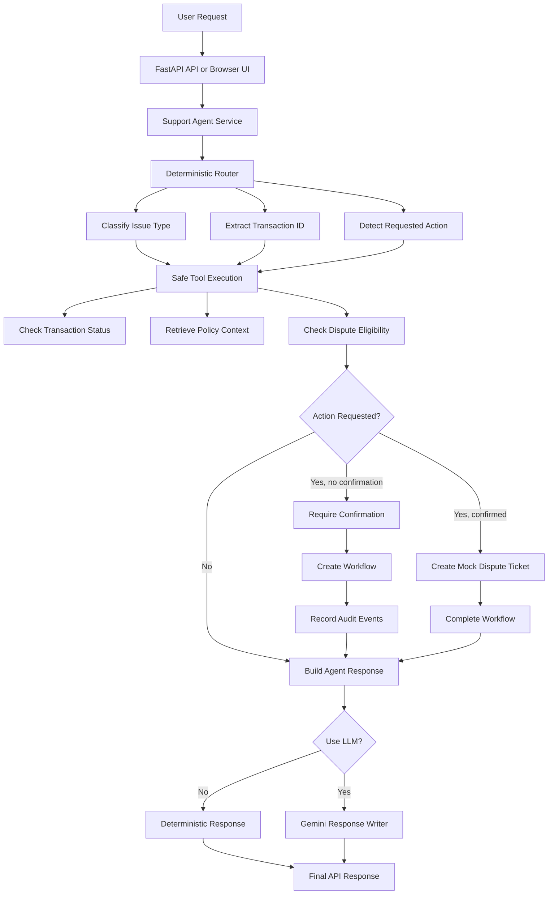

# Architecture

## Overview

The Banking Support Agent is a controlled tool-using support agent with a workflow automation layer for banking and fintech scenarios.

The project demonstrates how an AI system can use typed tools, deterministic routing, optional LLM-assisted response generation, confirmation-gated action tools, workflow state tracking, and audit events.

The core design principle is:

```text
Python controls the workflow.
Tools provide facts and controlled actions.
The LLM only writes the final response when enabled.
Workflow state and audit events make actions traceable.
```

## High-Level System Flow

```text
User / Browser UI / API Client
        ↓
FastAPI API Layer
        ↓
Support Agent Service
        ↓
Deterministic Router
        ↓
Safe Tool Execution
        ↓
Optional Gemini Response Writer
        ↓
Workflow Automation Layer
        ↓
Structured Agent + Workflow Response
```

## Main Runtime Flows

### 1. Information-Only Support Flow

```text
User asks a question
        ↓
Router classifies intent and extracts details
        ↓
Read-only and decision-support tools run
        ↓
Agent returns answer
        ↓
No workflow is created if no tracked action is needed
```

Example:

```text
I forgot my mobile banking password.
```

### 2. Action Request Without Confirmation

```text
User asks to raise a dispute
        ↓
Router detects requested action
        ↓
Tools check transaction, policy, and eligibility
        ↓
Agent requires confirmation
        ↓
Workflow is created as awaiting_confirmation
        ↓
Audit events are recorded
        ↓
Response returns workflow_id
```

Example:

```text
Please raise a dispute for TX1001.
```

### 3. Workflow Execution Flow

```text
Workflow is awaiting_confirmation
        ↓
/workflows/{workflow_id}/execute is called
        ↓
Workflow is confirmed
        ↓
Agent reruns controlled action path with confirm_action=true
        ↓
Mock dispute ticket is created
        ↓
Workflow is marked completed
        ↓
Audit events are updated
```

## Mermaid Flow



## Main Layers

### API Layer

Location:

```text
src/banking_agent/api/
```

Purpose:

- expose FastAPI endpoints
- serve the lightweight browser UI
- convert internal models into API response schemas
- map domain errors to HTTP responses

Key files:

```text
app.py
routes.py
schemas.py
dependencies.py
frontend_routes.py
```

Main endpoints:

```text
GET  /health
POST /support
GET  /workflows
POST /workflows
GET  /workflows/{workflow_id}
GET  /workflows/{workflow_id}/events
POST /workflows/{workflow_id}/confirm
POST /workflows/{workflow_id}/reject
POST /workflows/{workflow_id}/complete
POST /workflows/{workflow_id}/fail
POST /workflows/{workflow_id}/execute
GET  /ui
```

### Web UI Layer

Location:

```text
src/banking_agent/web/
```

Purpose:

- provide a lightweight browser demo
- call the `/support` and workflow endpoints
- display agent responses, tool calls, workflow status, workflow queue, and audit events

Key files:

```text
templates/index.html
static/app.js
static/styles.css
```

### Core Layer

Location:

```text
src/banking_agent/core/
```

Purpose:

- shared Pydantic schemas
- custom exceptions
- environment configuration

Key files:

```text
schemas.py
exceptions.py
config.py
```

Important models include:

```text
AgentResponse
ToolCallRecord
DisputeTicket
SupportWorkflow
WorkflowEvent
```

### Routing Layer

Location:

```text
src/banking_agent/routing/
```

Purpose:

- classify issue type
- extract transaction IDs
- detect requested actions
- decide which tools are needed

Key file:

```text
router.py
```

The router is deterministic so routing behaviour is predictable and testable.

### Tools Layer

Location:

```text
src/banking_agent/tools/
```

Purpose:

- mock transaction lookup
- mock policy context retrieval
- mock dispute eligibility check
- confirmation-gated dispute ticket creation

Key files:

```text
transaction_tools.py
policy_tools.py
dispute_tools.py
action_tools.py
```

Tool categories:

```text
Read-only:
- check_transaction_status
- retrieve_policy_context

Decision-support:
- check_dispute_eligibility

Action:
- create_dispute_ticket
```

### Service Layer

Location:

```text
src/banking_agent/services/
```

Purpose:

- orchestrate routing and tools
- enforce confirmation-gated action logic
- create workflow records when support actions need tracking
- manage workflow state transitions and audit events

Key files:

```text
agent_service.py
workflow_service.py
```

`agent_service.py` controls the agent logic.

`workflow_service.py` controls workflow state, valid transitions, and event logging.

### Generation Layer

Location:

```text
src/banking_agent/generation/
```

Purpose:

- build safe final-response prompts
- call Gemini when LLM-assisted mode is enabled

Key files:

```text
prompt_builder.py
llm_client.py
```

The LLM does not control tool execution. It receives completed tool results and writes a final response only when LLM-assisted mode is enabled.

## Workflow State Model

Workflow statuses:

```text
created
awaiting_confirmation
approved
completed
rejected
failed
```

Workflow event types:

```text
workflow_created
intent_classified
tool_called
confirmation_required
user_confirmed
action_completed
action_rejected
workflow_failed
```

The service validates status transitions so invalid actions fail safely.

## Testing Strategy

The project includes tests for:

- tool behaviour
- router behaviour
- agent service behaviour
- prompt building
- confirmation-gated actions
- workflow service transitions
- workflow audit events
- workflow API endpoints
- support-to-workflow integration
- workflow execution endpoint
- frontend route loading

Tests use deterministic behaviour and fake clients where needed, so they do not depend on live Gemini calls.

## Docker and CI

The project includes:

```text
Dockerfile
requirements-docker.txt
.github/workflows/ci.yml
```

The Docker image uses runtime-only dependencies.

GitHub Actions runs:

```text
pytest
Docker build with GitHub Actions cache
Docker container smoke test
/health check
/ui check
```
